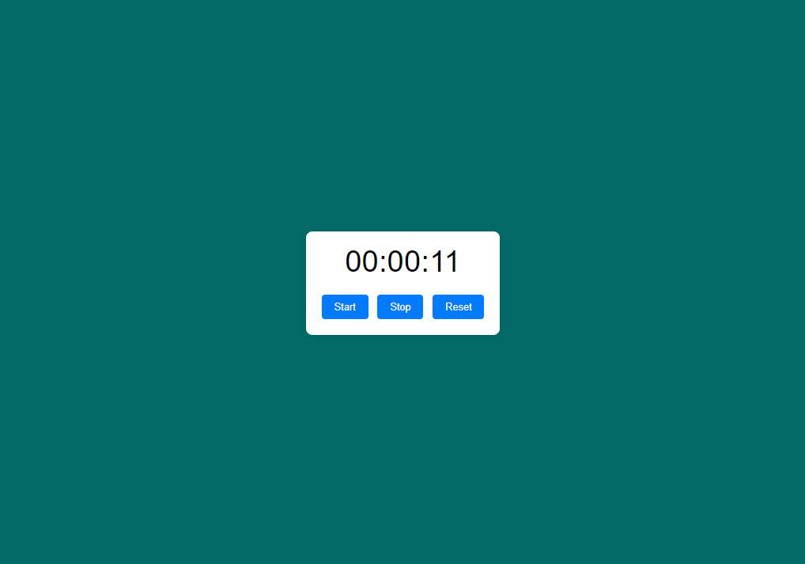

# Timer Application
<!DOCTYPE html> <html lang="en"> <head> <meta charset="UTF-8"> <meta name="viewport" content="width=device-width, initial-scale=1.0"> <title>Simple Timer</title> <link rel="stylesheet" href="styles.css"> </head> <body> 
 
 This project is a straightforward timer application that demonstrates the integration of HTML, CSS, and JavaScript to create a functional and visually appealing web tool. The timer can be started, stopped, and reset using interactive buttons. Here’s an overview of the components and their functionalities: 
 <h3>Features</h3> <ul> <li><strong>Start Timer</strong>: Begins the countdown, updating the display every second.</li> <li><strong>Stop Timer</strong>: Pauses the countdown without resetting the time.</li> <li><strong>Reset Timer</strong>: Stops the countdown and resets the display to <code>00:00:00</code>.</li> </ul> 
 This simple timer application demonstrates the power of combining HTML, CSS, and JavaScript to create a functional web tool. It provides a basic yet effective interface for users to interact with, making it a great starting point for learning and understanding the fundamentals of web development. 
 
 
 
00:00:00
 <button id="start-btn">Start</button> <button id="stop-btn">Stop</button> <button id="reset-btn">Reset</button> 
</body> </html>

<!-- LICENSE -->
## License

Distributed under the MIT License. Click [https://github.com/krsakshi/Timer/blob/main/LICENSE] for more information.
